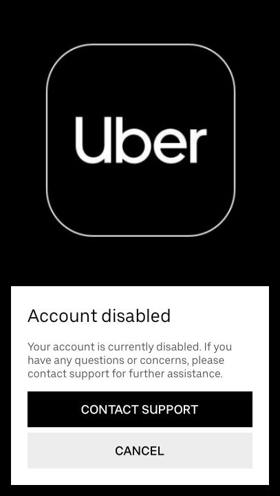

<h1 style="text-align: center;"> <span><b>Operation Restore Account</b></span></h1>



<style>
img {
  display: block;
  margin-left: auto;
  margin-right: auto;
}
</style>


<h2 style="text-align: center;"> <span><i>Objective</i></span></h2>

The goal of this project is to create a crawler to scrap LinkedIn for all Uber employees in San Francisco and São Paulo and mass email them a letter hoping that someone, somewhere would be customer oriented enough to reactivate my account. 


<h2 style="text-align: center;"> <span><i>Background</i></span></h2>

The idea for this project emerged when my Uber account was disabled, and after a long time trying to restore it, I became very frustrated and finally gave up trying fix it via customer service. If you are interested in knowing the whole story you should read the [email](uber.txt) I sent them. Long story short, my account started to get blocked for no reason. Every time I would reach their customer service and they would always say that it was just a glitch, and would promptly reactivate it. This went on and on until one day, without any explanation, they permanently disabled my account and stop responding me.

At this point, the smart move would have been to just change my phone number and get a new account. But after going through all the headache and having spent a lot of time emailing them back and forth, I refused to bow, and instead, had the "brilliant idea" to spend even <ins>more of my time</ins> on this issue and came up with this project. 


<h2 style="text-align: center;"> <span><i>Dataset</i></span></h2>

Uber doesn't really have a catalog or an API I could just pull their employees emails from so I had to get the data myself. I found through a friend that uber emails had two different formats, as shown in the example below:


Rafael Gama
```text
rafael@uber.com
```
```text
rafaelg@uber.com
```

Now I that knew Uber's email formats, all I needed was to get a list of employees first and last names and construct the emails. In order to do that, I developed a [crawler](crawler_linkedin.py) that goes to LinkedIn's people search section, selects a city and a company, and scrape all results.


<h2 style="text-align: center;"><span><i>Crawler Development</i></span></h2>

LinkedIn proved to be a worthy adversary and a particularly hard site to crawl. After analyzing the task, I came up with the following set challenges and solutions:

* ### LinkedIn requires Javascript to render content on the page
    I am familiar with both [selenium](https://selenium-python.readthedocs.io/) and [requests](https://requests.readthedocs.io/en/master/) but because of this peculiarity I couldn't crawl using requests so I had to settle for **selenium**

* ### Linkedin server reject a large series of requests from the same IP address in a given time period and suspends your ability to search for a few days. Also, the page rendering time would greatly vary between requests
    To avoid using long sleep times, I tried to use Selenium's Wait module to dynamically wait for the page to load but had little success. The code was unstable and breaking all the time so I was forced to increase the sleep times to solve both problems. 

* ### LinkedIn is on the look out for scraper bot behavior patters
    To decrease my chances of being flagged, I created and applied a set of functions that try to simulate human behavior by scrolling up and down and randomly clicking on profiles.
    


<h2 style="text-align: center;"><span><i>Data Preparation</i></span></h2>

The crawler extracted 1000 names for each city searched. 

* [San Francisco results](/data_collected/san_francisco.json)
* [São Paulo results](/data_collected/sao_paulo.json)

However, not all results were relevant for my purposes as many of the people no longer worked at Uber or were non corporate employees. So I had to [clean up the data](data_wrangling.py) a little and come up with a employee list that was relevant and would increase my chances of being helped while saving resources. The following steps were taken:

* **Searched and removed all duplicates and NaN**
* **Removed all results not currently employed at Uber**
* **Removed all employees in non-corporate positions**

After cleaning up the data, the next step was to develop a [email conscructor](email_factory.py) that would return the two email formats for each employee.


<h2 style="text-align: center;"><span><i>Execution</i></span></h2>

Finally, all that was left to do was to integrate the email constructor in the [email sender script](email_sender.py) and start bombarding Uber with emails, right?

Awwww, if it was only thas easy...There is still one challenge left to overcome: Servers restrictions at both ends.

* **Both's servers can flag my emails as spam**
* **Linkedin's server can percieve my emails as a security threat**
* **My provider (Gmail) has [email sending limits](https://support.google.com/a/answer/166852?hl=en) of their own**
    
Because the content of my emails is exactly the same aside the person being addressed, they are in considerable risk of being flagged as spam. At the same time, if the emailing frequency is too high, it may trigger a security alert. The million dollar question is, how much is too much? Because I am not a expert in servers, I decided to be cautious and **randomly space out** the time between emails in **batches of 20 emails** every **15 minutes**, until it hit the **350 per day** threshold I stipulated.


<h2 style="text-align: center;"><span><i>Results</i></span></h2>

I am still working on the project structure so I haven't started the emailing campaign as of this moment. Will be back soon with the outcome


<h2 style="text-align: center;"><span><i>Potential Improvements</i></span></h2>

Since this is a pet project, the first and foremost goal was to have it up a running as fast as possible so I could actually try to fix my problem and **restore my Uber account**. However, while I and I was working on the project, I had a lot ideas on what can be done to improve the crawler's performance, scalability and robustness. These are a few of those ideas:

* **Find a way to reduce the number and duration of sleep times**
* **Parallelize code in order to run multiple collection simultaneously**
* **Refactor code to use a workflow management system, to become more robust to failures and be able to resume pipelines from failing points**
