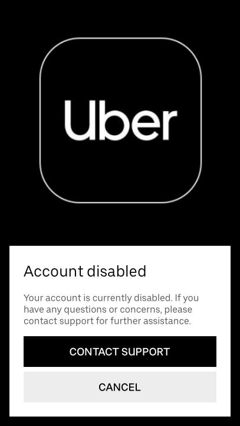
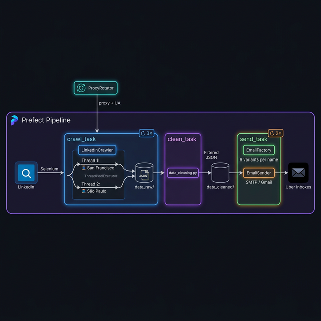

# Operation Restore Uber Account


> **Disclaimer:** This crawler was operational as of **05/18/2020**.
> Built purely as a personal experiment — not affiliated with Uber or LinkedIn.

<div align="center">
  
</div>

---

## Objective

Build a scraper to collect LinkedIn profiles of Uber employees in **San Francisco** and **São Paulo**, then mass-email them asking for help reactivating a permanently disabled account.

---

## Background

After my Uber account was repeatedly blocked without explanation — and after enduring multiple back-and-forths with customer support who called it a "glitch" every time — my account was suddenly **permanently disabled**.

Uber stopped responding. No warnings, no explanations.

The rational move would've been to create a new account with a different phone number. Instead, I poured even **more time and energy** into building a technical workaround. This is the result.

If you want the full story, check out the [email I sent them](uber.txt).

---

## Architecture



---

## Dataset Construction

Uber has no public employee directory or API. Based on prior emails from Uber, I identified two common email formats for an employee named **John Doe**:

```
john@uber.com
johnd@uber.com
```

With this pattern, all I needed was a list of names. The [crawler](crawler/crawler_linkedin.py) performs a LinkedIn People search filtered by city and company, scraping names and job titles from the results.

---

## Crawler Development

Crawling LinkedIn is a small war of attrition. Here's what went wrong — and how I duct-taped it into working:

- **JavaScript Rendering:**
  LinkedIn loads everything dynamically, so static HTTP scraping with `requests` was useless.
  I switched to Selenium, which could at least *pretend* to be human.

- **Rate Limiting & Bans:**
  Hit LinkedIn too fast and you're done.
  I tried clever dynamic waits with `WebDriverWait`, but reliability tanked — so I surrendered to long, static `sleep()` calls. Crude, but effective.

- **Anti-Bot Detection:**
  To look less like a bot, I made the crawler behave more like an impatient intern — random scrolling, unpredictable pauses, and the occasional useless profile visit.

  It wasn't elegant. But it survived long enough to get the data.

---

## 🧼 Data Preparation

Raw results by city:

| City          | Raw Records |
|---------------|-------------|
| San Francisco | 940         |
| São Paulo     | 1000        |

Most of that was noise — ex-employees, recruiters, and "LinkedIn Member" placeholders with no visible name. A custom [data cleaning script](data_cleaning/data_cleaning.py) filtered the dataset down to people actually worth emailing.

### Cleaning Steps

- Remove duplicates
- Exclude ex-Uber employees
- Remove profiles with the name "LinkedIn Member"
- Filter out drivers and non-corporate roles (Uber Eats, Uber Freight, Uber Air/Elevate)

**Final cleaned counts:**

| City          | Cleaned |
|---------------|---------|
| San Francisco | 764     |
| São Paulo     | 585     |

Next, an [email constructor](email_factory/email_factory.py) generates up to six possible email formats per employee. At least one had to hit someone's inbox.

---

## Execution Strategy

Once the emails were ready, I fed them into the [email sender script](email_sender/email_sender.py).
It should've been as simple as hitting "Send," right?

Not quite…

### Emailing Constraints

| Challenge | Detail |
|-----------|--------|
| Spam Filters | Identical bulk messages get flagged immediately |
| Gmail Limits | Strict daily send caps — see [Gmail's sending limits](https://support.google.com/a/answer/166852?hl=en) |
| Security Flags | Unusual activity triggers Google bot-detection |

### Rate Limit Strategy

- Send in **batches of 20 emails**
- Introduce **random time delays** between individual sends
- Cap at **360 emails per day**

This added just enough randomness to dodge spam filters while staying safely under Gmail's radar.

---

## Results

**Success.**
My account was reactivated after the **first batch** of emails.

### Stats

I expected better delivery rates — but later discovered Uber uses multiple email formats beyond the two I initially implemented. See this [reference](https://rocketreach.co/uber-email-format_b5ddab60f42e55aa) for more variations.

---

## Potential Improvements

This was a quick, impulsive hack that somehow evolved into a working system. If I ever revisited it:

- **Replace brute-force sleeps with smart waits** — use explicit Selenium conditions or event hooks instead of `sleep(5)`.

- **Parallelize the crawler** — run both cities simultaneously with `asyncio` or threads for twice the speed.

- **Add proxy rotation** — rotating IPs, headers, and user agents to distribute requests and reduce detection risk.

- **Audit data cleaning logic** — the mismatch between manual and Pandas counts still bugs me. Proper unit tests would resolve it.

* **Introduce workflow orchestration**:
A lightweight orchestrator like Prefect, Luigi, or Airflow would let the process recover from partial failures and make it reproducible — not just “Raff’s cursed cron job that somehow works.”

---

## Setup

```bash
# 1. Install dependencies
pip install -r requirements.txt

# 2. Configure your credentials
cp .env .env && nano .env   # fill in LinkedIn & Gmail credentials

# 3. Install ChromeDriver matching your Chrome version
#    https://chromedriver.chromium.org/

# 4. Run the full pipeline
python main.py

# — or run each step independently —
python crawler/crawler_linkedin.py
python data_cleaning/data_cleaning.py
python email_sender/email_sender.py
```

---

## Final Thoughts

What started as a small act of stubbornness turned into a full-blown automation pipeline.
It was unnecessary, slightly obsessive, and definitely not the most efficient solution — but it worked.

My Uber account is back and working as of 10/12/2025.
Let’s see how long it stays that way!
